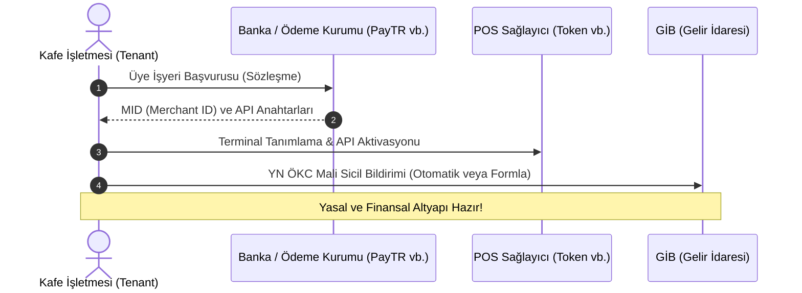

# Bulut POS ve Ödeme Sistemleri Yasal & Operasyonel Yol Haritası

İşlek uygulamasını bulut tabanlı bir POS (Cloud POS) sistemine bağlarken işin içine bankalar, ödeme kuruluşları (PSP - Payment Service Provider) ve mali otoriteler (GİB) girmektedir. Bu yasal ve operasyonel süreçlerin hem **yazılım sağlayıcı (İşlek - SaaS)** hem de **üye işyeri (Kafeler - Tenant)** seviyesinde yönetilmesi gerekir.

---

## 1. Yazılım Sağlayıcı Olarak İşlek'in Sorumlulukları (SaaS Rolü)

İşlek bir banka veya ödeme kuruluşu değildir; sadece **teknik bir entegratördür (ISV - Independent Software Vendor)**. Bu nedenle yasal süreçler BDDK lisansı almanızı gerektirmez, ancak teknik güvenlik standartlarına uymanız zorunludur.

### A. PCI-DSS Uyum Gerekliliği (Kart Güvenliği)
* **Altın Kural:** İşlek sunucularına veya Redis veritabanına **asla kredi kartı bilgisi (kart numarası, CVC, son kullanma tarihi) kaydedilmemeli ve dokunulmamalıdır**.
* Bütün kart verisi ve çekim işlemleri POS entegratörünün (örn. Token Gateway, PayTR) kendi SDK/API'si ve güvenli sayfaları (Iframe/Hosted Payment Page) üzerinden **Tokenization** yöntemiyle yönetilmelidir. Bu sayede İşlek, ağır ve maliyetli PCI-DSS sertifikasyon süreçlerinden muaf kalır.

### B. Güvenlik ve webhook Doğrulaması
* POS sunucularından gelen "Ödeme alındı" webhook çağrıları şifrelenmeli (HMAC/Signature doğrulaması yapılmalı) ve kötü niyetli kişilerin sahte ödeme bildirimleri atarak adisyon kapatması engellenmelidir.

---

## 2. Kafelerin (Tenant) İzlemesi Gereken Yasal & Operasyonel Süreç

Sistemi kullanacak olan her kafe sahibi kendi adına yasal ve finansal başvuruları tamamlamak zorundadır.

### Adım 1: Finansal Anlaşma (Üye İşyeri Sözleşmesi)
* Kafe sahibi, ödemelerin toplanacağı banka veya lisanslı ödeme kuruluşu (PayTR, iyzico, Token vb.) ile doğrudan anlaşma imzalar.
* **Üye İşyeri Numarası (Merchant ID - MID):** Başvuru onaylandığında kafe sahibine verilir. Bu numara, çekilen paraların kafenin hangi banka hesabına yatırılacağını belirler.

### Adım 2: Cihaz (ÖKC) Alımı ve Aktivasyon
* Kafe, bulut entegrasyonu destekleyen yeni nesil bir cihaz (ör. Beko 300TR / 400TR) satın alır veya kiralar.
* Cihazın seri numarası, üye işyerinin vergi numarasıyla entegratör panelinde (Token Platform vb.) eşleştirilir ve bulut erişimi aktif edilir.

### Adım 3: Gelir İdaresi Başkanlığı (GİB) Bildirimi
* Türkiye'deki yasal süreç gereği, yeni nesil yazar kasaların (YN ÖKC) maliyet birimiyle eşleşmesi yetkili servis kurulumu sırasında otomatik olarak GİB sistemlerine (ÖKC Bilgi Sistemi) kaydedilir.
* Eğer entegrasyon bir e-fatura/e-arşiv fatura modeliyle yürüyecekse, kafenin bir **Özel Entegratör** (örn. Trendyol e-Fatura, QNB e-Finans) ile anlaşıp e-Arşiv fatura altyapısını aktif etmesi gerekir.

---

## 3. Para Akışı ve Komisyon Modeli Nasıl Yönetilir?

SaaS platformlarında iki farklı finansal akış modeli kurgulanabilir:

### Model A: Doğrudan POS Modeli (Önerilen)
* **Nasıl Çalışır:** Kafe doğrudan banka/PayTR ile anlaşır ve kendi POS cihazını kullanır. İşlek sadece aradaki yazılım tetiğini çeker.
* **Para Akışı:** Müşterinin kartından çekilen tutar **doğrudan kafenin banka hesabına** yatar. İşlek para akışına hiç dokunmaz.
* **İşlek Nasıl Kazanır:** Kafelerden aylık/yıllık sabit SaaS abonelik bedeli veya POS firmasıyla yapılan iş ortaklığı üzerinden yönlendirilen cirodan komisyon (revenue share) alınır.
* **Avantajı:** Yasal olarak hiçbir finansal risk barındırmaz, BDDK denetimine girmez.

### Model B: Hak Ediş / Pazar Yeri Modeli (Marketplace)
* **Nasıl Çalışır:** İşlek tek bir ana anlaşma yapar (örn. PayTR Pazar Yeri API). Müşterilerden çekilen para önce İşlek'in havuz hesabına gelir.
* **Para Akışı:** İşlek kendi komisyonunu kesip kalan tutarı otomatik olarak kafelerin hesaplarına transfer eder (Split Payment).
* **Avantajı:** Kafelerin tek tek POS başvurusu yapması gerekmez, anında aktif olurlar.
* **Dezavantajı:** BDDK mevzuatına göre lisans alma zorunluluğu veya çok sıkı yasal denetimler (KYC/Kara Para Aklama vb.) gerektirir. Küçük bir SaaS için ilk aşamada **kesinlikle önerilmez**.

---

## 4. Uygulama ve Entegrasyon Adımları Planı

Bulut POS'u devreye alırken İşlek panelinde olması gereken ekranlar:

1. **Yönetici Ayarları (Tenant Ayarları):**
   - POS Entegrasyon Paneli (Token API Key, Merchant ID vb. alanlar).
   - Masa-POS eşleştirme alanı (Hangi masa hangi fiziksel POS cihazına istek gönderecek?).
2. **Kasa / Masa Detay Ekranı:**
   - Ödeme yöntemleri arasına "Kart (POS)" eklenecek.
   - Tetikleme yapıldığında ekranda "POS Cihazından Ödeme Bekleniyor..." animasyonu gösterilecek.
   - POS'tan başarılı yanıt geldiğinde masa otomatik kapatılacak.
